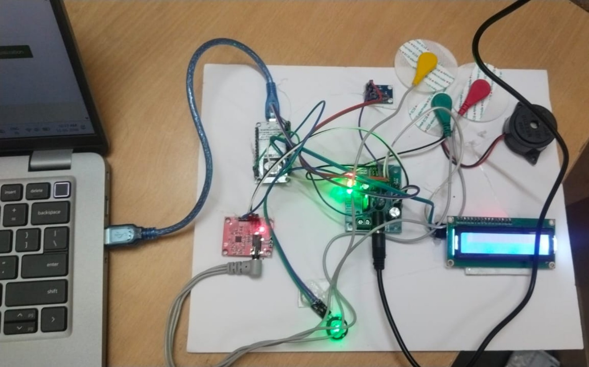
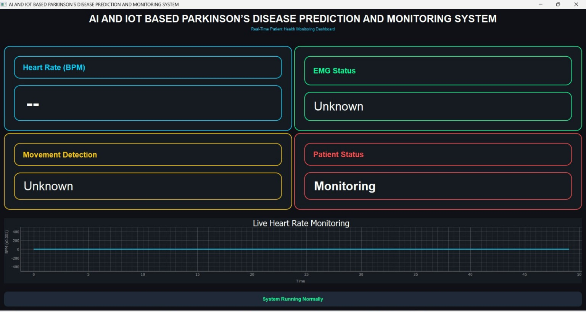
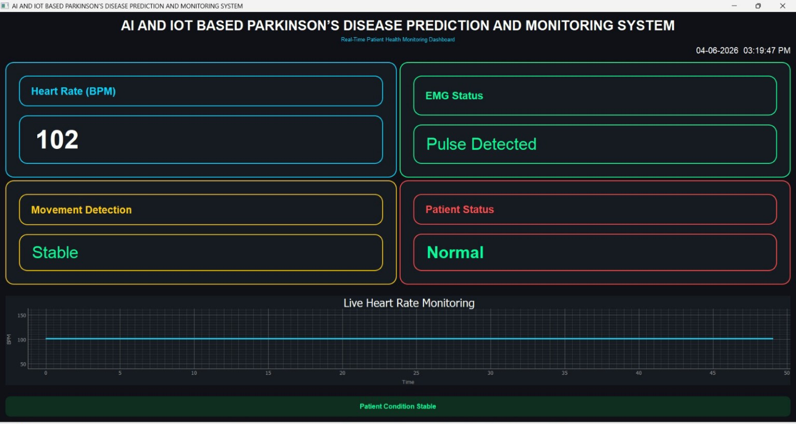

# AI and IoT Based Parkinson's Disease Prediction and Monitoring System

A group project developed as a smart healthcare solution for Parkinson's
disease prediction and continuous patient monitoring using IoT,
Artificial Intelligence, Machine Learning, cloud technologies, and a web
dashboard.

## Project Type

-   **Type:** Group Project
-   **Academic Project:** Bachelor of Engineering -- Computer Science
    and Engineering
-   **Institution:** Velammal Institute of Technology, affiliated to
    Anna University
-   **Project Period:** 2025--2026
-   **Team Size:** 4

## Project Overview

The system is designed to collect patient health information such as
tremor signals, heartbeat rate, muscle activity, and body movement using
wearable sensors. Sensor data is collected through an ESP32/NodeMCU
microcontroller and transmitted through Wi-Fi for further processing and
monitoring.

The project documentation describes Python-based backend processing,
preprocessing operations such as noise filtering, normalization and
feature extraction, an XGBoost machine-learning model for prediction,
cloud-based storage/monitoring, and a Streamlit dashboard for remote
monitoring.

## Main Components

-   Wearable/physiological sensors
-   ESP32 / NodeMCU microcontroller
-   Wi-Fi / IoT communication
-   Python backend processing
-   XGBoost machine-learning model
-   Cloud data storage and monitoring
-   Streamlit web dashboard
-   LCD display
-   Buzzer alert system

## Key Modules

1.  Sensor Data Collection Module
2.  IoT Communication Module
3.  Data Processing Module
4.  Machine Learning Prediction Module
5.  Alert and Monitoring Module

## My Role -- Manual Tester

I worked as a **Manual Tester** in this group project.

My testing responsibilities included:

-   Understanding the functional requirements and system flow.
-   Preparing manual test scenarios and test cases.
-   Verifying sensor/data-collection related functionality.
-   Checking IoT communication and data transmission.
-   Verifying data processing and prediction flow from a functional
    perspective.
-   Testing dashboard data display and monitoring functionality.
-   Verifying alert-related behavior such as buzzer/LCD notifications.
-   Checking cloud data storage and retrieval behavior.
-   Recording test results and documenting defects when identified.
-   Performing regression verification after fixes.

## Testing Areas

The project report identifies these testing areas:

-   Sensor and Data Collection Testing
-   IoT Communication and Cloud Testing
-   Data Processing and Machine Learning Testing
-   Dashboard and Alert System Testing
-   Cloud Database Testing

## Team Source Code

The repository includes a sanitized copy of the **team implementation source code** for project reference. My primary role in the group project was **Manual Tester**, so I do not claim ownership of the development implementation.

- [Team Source Code](source-code/README.md)
- [Python Requirements](source-code/requirements.txt)

The public versions of the Python files have had hardcoded ThingSpeak credentials removed.

## Documentation

-   [Project Overview](docs/Project-Overview.md)
-   [System Testing Overview](testing/Test-Plan.md)
-   [Test Scenarios](testing/Test-Scenarios.md)
-   [Test Cases](testing/Test_Cases.xlsx)
-   [Bug Report Template](testing/Bug-Report.xlsx)
-   [Test Summary](testing/Test-Summary.md)

## UML / System Design Diagrams

The following diagrams are extracted from the final project report:

- [System Design Architecture](docs/01_System_Design_Architecture.png)
- [Sequence Diagram](docs/02_Sequence_Diagram.png)
- [Use Case Diagram](docs/03_Use_Case_Diagram.png)
- [Class Diagram](docs/04_Class_Diagram.png)
- [Deployment Diagram](docs/Deployment-Diagram.png)

## Screenshots / Demo Evidence

### Hardware Setup

The hardware setup shows the connected controller, sensors, LCD display, buzzer and supporting wiring used for the prototype.

### Dashboard – Initial State

The dashboard provides real-time monitoring fields for heart rate, EMG status, movement detection and patient status.

### Dashboard – Normal Monitoring

The monitoring dashboard displays a heart-rate value, pulse detection, movement status, patient status and a live heart-rate graph.

## System Design

The project report contains:

-   System Architecture
-   Sequence Diagram
-   Use Case Diagram
-   Class Diagram
-   Deployment Diagram

## Technologies Mentioned in the Project

-   Python
-   Machine Learning
-   XGBoost
-   IoT
-   ESP32 / NodeMCU
-   Arduino IDE
-   Blynk / ThingSpeak
-   Streamlit
-   MySQL / Cloud Storage
-   HTML / CSS / JavaScript

## Security Note

Do **not** upload Wi-Fi passwords, API keys, tokens, credentials, or
other secrets to a public GitHub repository. Any credentials appearing
in the academic report should be removed or replaced before publishing
source code.

## Team

-   Bonsle Sujitha
-   Kilari Dhanya
-   Rayavarapu Likhitha
-   Udatha Sravanthi

## Disclaimer

This is an academic project and should not be treated as a medical
diagnostic system. The repository documents the project implementation
and testing work performed as part of the academic project.
